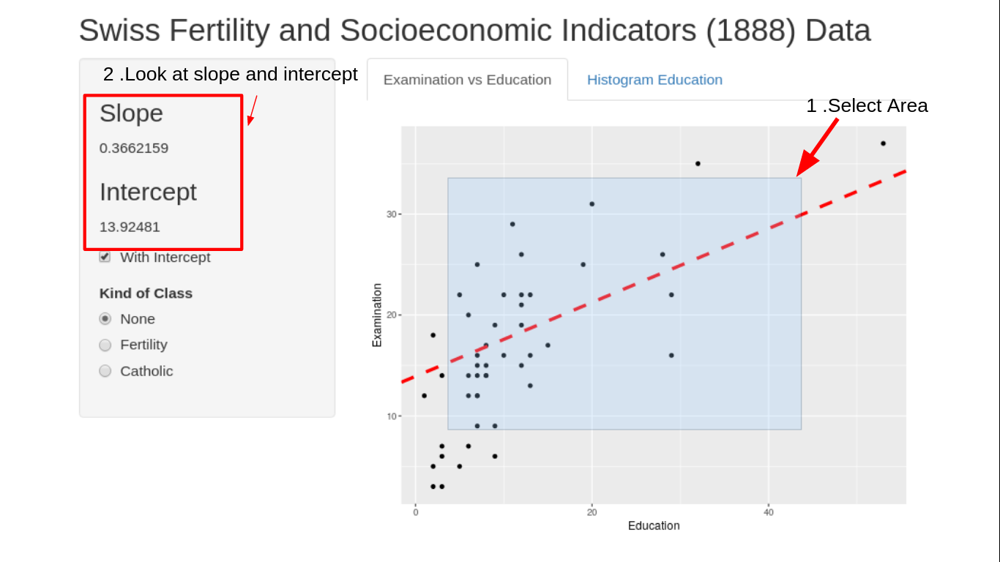
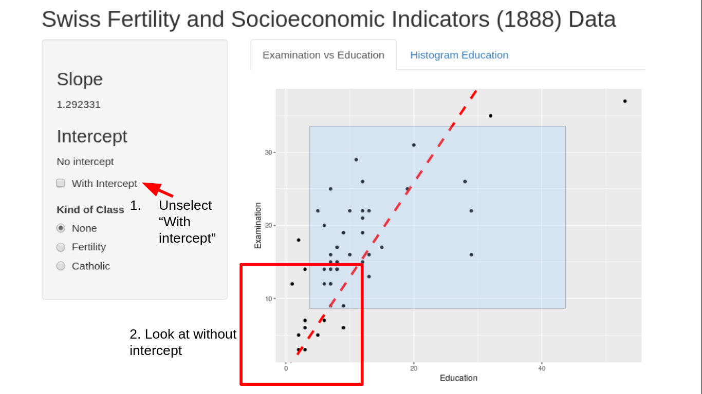
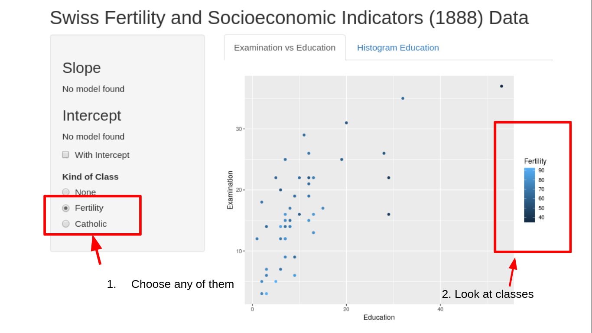
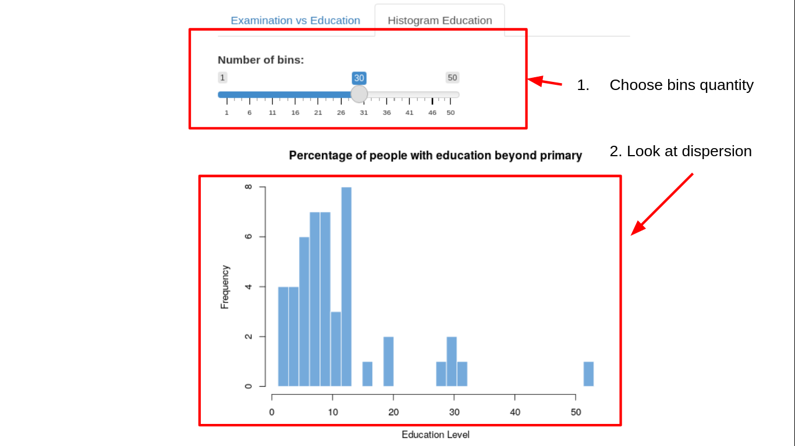

## Functionality 1
As user, I can select a square area and get the slope and intercept component based on the liner regression between the selected points.  

## Functionality 2
As user, I can ommit the intercept component with unchosing the WithIntercept choice in the side bar panel on the left.  

## Functionality 3
As user, I can get more information selecting Fertility and Catholic options, after selecting any of these variables, the plot will coloring the points depending of theses variables so we can get how they are classified.  

## Functionality 4
As user, I can variety the number of bins in order to see how disperse the data are.  

